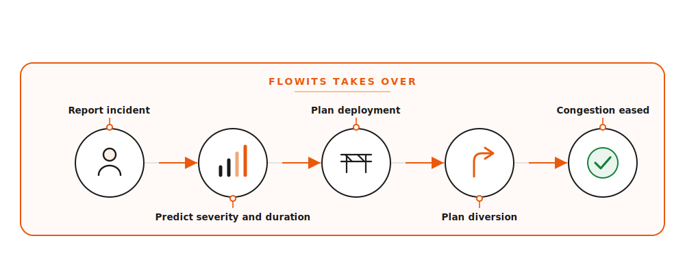
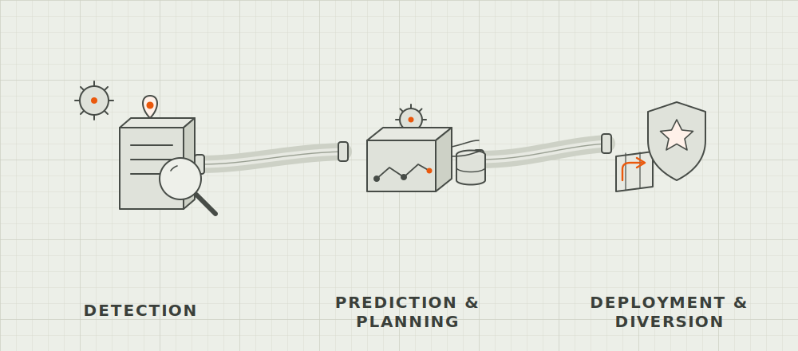

# FLOWITS

Decision support for event-driven traffic congestion, planned and unplanned.

---

## 1. Description

FLOWITS is a decision-support system for traffic control rooms. When a planned event (an IPL match, a rally, a festival) or an unplanned incident (an accident, a breakdown, waterlogging) is about to choke a corridor, FLOWITS forecasts how severe it will get, how long it will last, and the real risks around it, then plans the manpower, the barricading, and the public diversion before it happens. It learns from every logged outcome, so it gets sharper with use.

An officer gives only three things: the event type, the location by name, and the time. The model works out the rest.

---

## 2. Quick links

<!-- REPLACE the placeholders below with the final links -->

| | |
|---|---|
| Live demo | https://flowits-production.up.railway.app/ |
| Demo video | _link to be added_ |
| Telegram bot | _coming soon (see section 6)_ |

---

## 3. Architecture diagram

<div align="center">

</div>

An incoming event runs through the **Severity Engine**, the **FLOWITS Engine** orchestrates a **Deployment Planner** and a **Diversion Planner**, and the officer receives a complete plan. An incident database and an outcome feedback loop retrain the model, and a live news feed supplies upcoming events.

---

## 4. How it works

<div align="center">

</div>

1. **Report incident.** The officer enters event type, location, and time.
2. **Predict severity and duration.** Two gradient-boosting models forecast how bad and how long.
3. **Plan deployment.** Officers and barricades are placed on the corridor graph.
4. **Plan diversion.** A reroute is drawn around the blockage on a live map.
5. **Congestion eased.** The outcome is logged and feeds back into the model.

A second, illustrative view of the same flow:

<div align="center">

</div>

---

## 5. Approach

FLOWITS pairs a trained machine learning model with a transparent operational playbook, so it stays honest rather than acting as a black box.

- **The model** forecasts severity (four classes) and duration statistically from 8,057 historical incidents.
- **The playbook** is a stated rule layer that adds what the data cannot know, such as treating a marquee event (IPL, rally, concert) as high impact and flagging secondary risks like crowd surge, theft, and scuffles.
- **Impact first.** The output leads with consequences in plain language. The severity score is shown, but it is not the headline.
- **Officer first.** No coordinates and no technical input are needed. The system fills in the rest.
- **Honest by design.** It shows its confidence and its limits. High-severity classes are rare in the data, and the system says so and asks an officer to confirm.

Validated performance: cross-validated F1 of 0.859, ROC AUC of 0.974, duration MAE of about 52 minutes, across 12 leakage-controlled features.

---

## 6. Telegram bot (planned, to be deployed)

A Telegram bot will be the field-facing front door to FLOWITS, so an officer on the ground does not need the dashboard open.

How it will work:
1. The officer messages the bot with the event type, the location by name, and the time (a guided prompt or a simple `/plan` command).
2. The bot calls the same FLOWITS API used by the web app (`/predict` and `/allocate`).
3. The bot replies with the impact assessment, the recommended manpower and barricades per junction, and a link to the diversion map.
4. After the event, the officer can log the actual outcome back through the bot, which feeds the learning loop.

This reuses the existing backend, so no separate model or logic is needed. It is not yet deployed.

---

## 7. What this project does

- Forecasts the severity and duration of event-driven congestion for **both planned and unplanned** events.
- Leads with **impact**: crowd surge, theft, scuffles, and queue build-up, in plain language.
- Recommends **manpower and barricades** per junction, scaled to the forecast severity.
- Lays out a **public diversion** on a real Bengaluru map (shortest path around the blockage).
- Generates a one-click **briefing report** (printable PDF) with a peak-risk-by-hour chart.
- Monitors a **live event feed** for upcoming rallies, matches, and incidents.
- **Learns** from every logged outcome to sharpen future forecasts.

---

## 8. Tech stack

| Layer | Technology |
|---|---|
| Frontend | React, Vite, TypeScript, Tailwind CSS |
| Visualisation | Leaflet (OpenStreetMap), Recharts |
| Backend / API | FastAPI, Pydantic, Uvicorn (Python 3.11) |
| Machine learning | scikit-learn (Gradient Boosting, K-Means) |
| Planning / routing | NetworkX corridor graph, Dijkstra shortest path |
| Live data | Google News RSS (stdlib urllib + ElementTree) |
| Deployment | Railway (the backend serves the built frontend) |

---

## 9. Repository structure

```
FLIPKART_PROTOTYPE/
├─ backend/
│  ├─ main.py                 # FastAPI app and API endpoints
│  ├─ train.py                # trains the models, writes model_artifacts
│  ├─ requirements.txt
│  ├─ src/
│  │  ├─ model.py             # gradient-boosting classifier + regressor
│  │  ├─ feature_engineering.py
│  │  ├─ graph_builder.py     # corridor graph + Dijkstra diversion
│  │  ├─ allocation.py        # officer / barricade allocation
│  │  ├─ playbook.py          # transparent domain rule layer
│  │  ├─ events_feed.py       # live Google News RSS + curated watchlist
│  │  ├─ feedback.py          # outcome logging and learning loop
│  │  └─ schemas.py           # Pydantic request / response models
│  ├─ model_artifacts/        # trained models (.pkl) + metrics.json
│  ├─ data/                   # incident dataset
│  └─ static/                 # built frontend served in production
├─ frontend/
│  ├─ src/
│  │  ├─ components/          # AppShell, dashboard, map, cards, forms
│  │  ├─ api/                 # API client
│  │  └─ ...
│  └─ public/
├─ images/                    # architecture and flow diagrams
└─ README.md
```

---

## 10. Run locally

**Prerequisites:** Python 3.11+ and Node.js 18+.
The trained models are committed in `backend/model_artifacts/`, so the app runs without retraining.

### Backend (API on port 8001)

```bash
cd backend
python -m venv .venv
# Windows:
.venv\Scripts\activate
# macOS / Linux:
source .venv/bin/activate

pip install -r requirements.txt
uvicorn main:app --port 8001
```

To retrain the models from the dataset (optional):

```bash
python train.py
```

### Frontend (dev server on port 5173)

```bash
cd frontend
npm install
npm run dev
```

Open `http://localhost:5173`. The dev server expects the API on `http://127.0.0.1:8001`.

### Single-link (production) mode

The backend serves the built frontend, so the whole app runs on one URL:

```bash
cd frontend
npm run build          # outputs to frontend/dist
# copy the build into backend/static, then:
cd ../backend
uvicorn main:app --port 8001
```

Open `http://localhost:8001`.

---

## 11. Pre-existing tools and assets used

- **Open-source libraries:** FastAPI, Uvicorn, Pydantic, scikit-learn, NetworkX, pandas, NumPy, React, Vite, Tailwind CSS, Recharts, Leaflet, axios.
- **Map tiles:** OpenStreetMap (free, open data).
- **Live event signal:** Google News RSS (free, no API key).
- **Fonts:** Geist Pixel Grid (branding) and Inter (interface).
- **Dataset:** a Bengaluru traffic-incident dataset of 8,057 records, used to train and validate the models.

All other logic (the models, the corridor graphs, the playbook, the allocation and diversion, the UI) was built for this project.

---

## 12. Future scope

- Extend from a few corridors to a full city, and onward to other cities, using the same framework.
- Connect to official event listings, CCTV and sensor feeds, and live GPS traffic data.
- Calibrate the manpower and barricade guidance against real deployment records.
- Deploy the Telegram bot for field officers.
- Add a mobile-friendly view and multi-language support.

---

<div align="center">

## 13. Thanks

Built with care by **Team Antigravity**.

</div>
