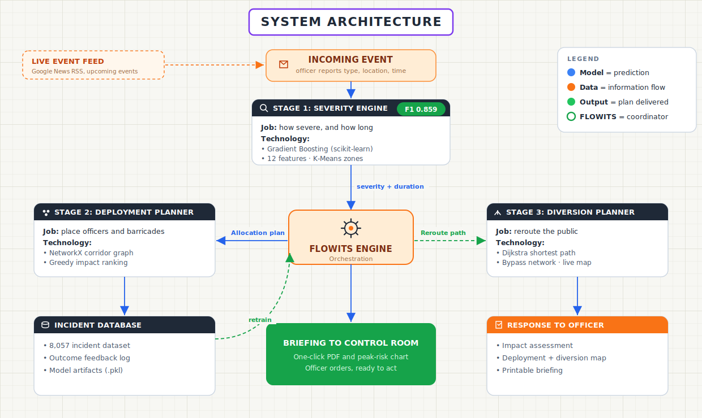
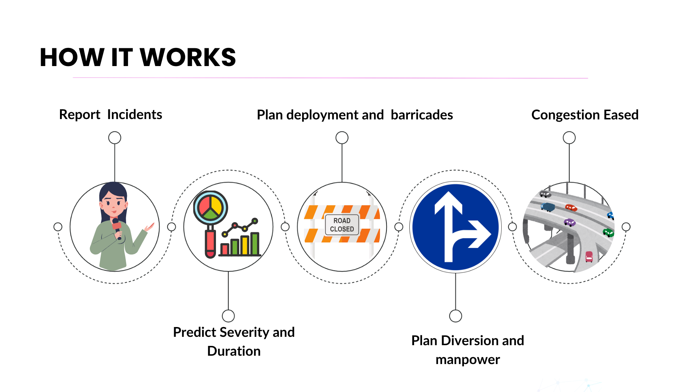

# FLOWITS

Decision support for event-driven traffic congestion, planned and unplanned.

---

## 1. Description

FLOWITS is a decision-support system for traffic control rooms. When a planned event (an IPL match, a rally, a festival) or an unplanned incident (an accident, a breakdown, waterlogging) is about to choke a corridor, FLOWITS forecasts how severe it will get, how long it will last, and the real risks around it, then plans the manpower, the barricading, and the public diversion before it happens. It learns from every logged outcome, so it gets sharper with use.

An officer gives only three things: the event type, the location by name, and the time. The model works out the rest.

---

## 2. Quick links

<!-- REPLACE the placeholders below with the final links -->

| | |
|---|---|
| Live demo | https://flowits-production.up.railway.app/ |
| Demo video | _link to be added_ |
| Telegram bot | _coming soon (see section 6)_ |

---

## 3. Architecture diagram

<div align="center">

</div>

An incoming event runs through the **Severity Engine**, the **FLOWITS Engine** orchestrates a **Deployment Planner** and a **Diversion Planner**, and the officer receives a complete plan. An incident database and an outcome feedback loop retrain the model, and a live news feed supplies upcoming events.

---

## 4. How it works

<div align="center">

</div>

1. **Report incident.** The officer enters event type, location, and time.
2. **Predict severity and duration.** Two gradient-boosting models forecast how bad and how long.
3. **Plan deployment.** Officers and barricades are placed on the corridor graph.
4. **Plan diversion.** A reroute is drawn around the blockage on a live map.
5. **Congestion eased.** The outcome is logged and feeds back into the model.


## 5. Approach

The problem statement asks us to handle event-driven congestion, both planned and unplanned, end to end: see it coming, judge how bad it is, and plan the response. We solved this by combining a trained machine learning core with a transparent operational playbook and a graph-based planner, all behind an officer-first interface. This section walks through how each piece works and why we chose it.

### The problem, reframed

A control-room officer can tell you the event type, the location by name, and the time, but not latitude and longitude or a severity score. So the system is built around those three inputs and fills in everything else. It also leads with **impact** (the real consequences) rather than a raw number, because that is what an officer acts on.

### Data and feature engineering

The models are trained on a dataset of **8,057 real Bengaluru traffic incidents**. From each incident we build **12 leakage-controlled features**, including:

- Historical closure rates by cause, junction, corridor, zone, and spatial cluster (how often that kind of incident or that place needed a road closure in the past).
- Time signals: hour of day, day of week, weekend flag, peak-hour flag.
- The `is_planned` flag (planned event vs unplanned incident) and the reported priority.

**K-Means clustering** groups all incident locations into 15 spatial risk zones, so a brand-new location inherits the behaviour of its neighbourhood. To avoid data leakage, all historical rates are computed on the **training split only**, never on the test data.

### The models, and why

- **Severity classifier** (`scikit-learn` GradientBoostingClassifier): predicts one of four response classes (Monitor, Single officer, Standard response, Maximum response). We chose **gradient boosting** because it is the strongest general approach for small-to-medium **tabular** data with mixed signals and non-linear interactions, it is robust without heavy tuning, and it returns both class **probabilities** and **feature importances**, which makes every prediction explainable rather than a black box. The high-severity classes are rare, so we use **balanced class weights** and **tuned decision thresholds** for classes 2 and 3 to recover them without wrecking the common classes.
- **Duration regressor** (GradientBoostingRegressor): predicts how many minutes the incident will take to clear, shown as an approximate range.

### Metrics (reported honestly)

- **Cross-validated F1 of 0.859** (5-fold, plus or minus 0.009, so performance is stable), **ROC AUC of 0.974**.
- **Per-class F1:** Monitor 0.87, Single officer 0.92, Standard 0.38, Maximum 0.26. We **show** the weakness on the two rare high-severity classes instead of hiding it, and the app tells the officer to confirm those on the ground.
- **Duration MAE of about 52 minutes** (RMSE about 80 minutes).
- We publish the **confusion matrix** and the **feature importances** (reported priority and the historical closure rates carry most of the signal).

### The domain playbook (why the model alone is not enough)

Statistics cannot know that an IPL match or a political rally is inherently high impact, or that a night-time gathering carries a higher theft and altercation risk, because those signals are not in the data. The **playbook** is a transparent, stated rule layer that sits on top of the model: it applies severity floors for marquee events, adds secondary-risk watch-fors (crowd surge, pickpocketing, scuffles), and amplifies risk at peak hours and at night. It is clearly labelled as operational rules, not model output, so the system stays honest.

### Planning: manpower and barricades

Each supported corridor is modelled as a **NetworkX directed graph** of junctions. An impact score spreads from the incident to nearby and downstream junctions. A **greedy allocator** then places officers on the highest-impact junctions first, and barricades on the **bottleneck junctions** (in-degree of 2 or more, where traffic streams merge). The size of the resource pool scales with the model's severity class (0, 1, 3, or 6 officers from Monitor up to Maximum). Finally we compute a **before-and-after risk reduction** so the officer can see the value of the plan (a stated 35 percent mitigation per resourced junction, pending calibration against real deployment data).

### Routing: the public diversion (Dijkstra)

To reroute the public around the blockage, we take the corridor graph, **remove the blocked junction**, and add parallel **bypass edges** weighted with a 1.6 times detour cost. We then run **Dijkstra's shortest-path** algorithm (via NetworkX, using edge travel-time weights) from the intercept point to the rejoin point on the far side, which gives the lowest-time reroute and the **extra minutes** the detour adds. This is the part of the problem statement (diversion planning) that most prototypes skip.

### Live event ingestion

Upcoming events come from a **Google News RSS** feed (no API key needed), keyword-matched to known junctions and event types, with a curated watchlist so the board is never empty. Any event that maps to a supported corridor becomes a one-click pre-plan.

### Why visualization, and which ones

Officers think in maps and minutes, not in JSON, so the output is visual:

- **Leaflet with OpenStreetMap tiles:** a real Bengaluru map that shows the incident, the placed officers and barricades, and the diversion route, with an SVG schematic fallback if tiles fail to load.
- **Recharts:** an incidents-by-hour bar chart (to spot peak windows), a planned-vs-unplanned event-mix donut, a running-accuracy "learning loop" figure, and, on the About page, the per-class F1 bars and feature-importance bars.
- **Confusion matrix image:** published for model transparency.
- **Printable briefing report (PDF):** a one-click document with a peak-risk-by-hour chart that the control room can hand out.

### The learning loop

Every logged outcome is stored and feeds back into the system, so the models retrain as real data accrues and accuracy improves with use rather than going stale.

### How it all solves the problem

End to end: the officer enters three fields, the models forecast severity and duration, the playbook adds the real-world impact, the corridor graph plans the manpower, the barricading, and a public diversion, a briefing is generated, and the outcome is logged to sharpen the next forecast. The result turns a reactive control room into a planning one, for both planned and unplanned events.

---

## 6. Telegram bot (planned, to be deployed)

A Telegram bot will be the field-facing front door to FLOWITS, so an officer on the ground does not need the dashboard open.

How it will work:
1. The officer messages the bot with the event type, the location by name, and the time (a guided prompt or a simple `/plan` command).
2. The bot calls the same FLOWITS API used by the web app (`/predict` and `/allocate`).
3. The bot replies with the impact assessment, the recommended manpower and barricades per junction, and a link to the diversion map.
4. After the event, the officer can log the actual outcome back through the bot, which feeds the learning loop.

This reuses the existing backend, so no separate model or logic is needed. It is not yet deployed.

---

## 7. What this project does

- Forecasts the severity and duration of event-driven congestion for **both planned and unplanned** events.
- Leads with **impact**: crowd surge, theft, scuffles, and queue build-up, in plain language.
- Recommends **manpower and barricades** per junction, scaled to the forecast severity.
- Lays out a **public diversion** on a real Bengaluru map (shortest path around the blockage).
- Generates a one-click **briefing report** (printable PDF) with a peak-risk-by-hour chart.
- Monitors a **live event feed** for upcoming rallies, matches, and incidents.
- **Learns** from every logged outcome to sharpen future forecasts.

---

## 8. Tech stack

| Layer | Technology |
|---|---|
| Frontend | React, Vite, TypeScript, Tailwind CSS |
| Visualisation | Leaflet (OpenStreetMap), Recharts |
| Backend / API | FastAPI, Pydantic, Uvicorn (Python 3.11) |
| Machine learning | scikit-learn (Gradient Boosting, K-Means) |
| Planning / routing | NetworkX corridor graph, Dijkstra shortest path |
| Live data | Google News RSS (stdlib urllib + ElementTree) |
| Deployment | Railway (the backend serves the built frontend) |

---

## 9. Repository structure

```
FLIPKART_PROTOTYPE/
├─ backend/
│  ├─ main.py                 # FastAPI app and API endpoints
│  ├─ train.py                # trains the models, writes model_artifacts
│  ├─ requirements.txt
│  ├─ src/
│  │  ├─ model.py             # gradient-boosting classifier + regressor
│  │  ├─ feature_engineering.py
│  │  ├─ graph_builder.py     # corridor graph + Dijkstra diversion
│  │  ├─ allocation.py        # officer / barricade allocation
│  │  ├─ playbook.py          # transparent domain rule layer
│  │  ├─ events_feed.py       # live Google News RSS + curated watchlist
│  │  ├─ feedback.py          # outcome logging and learning loop
│  │  └─ schemas.py           # Pydantic request / response models
│  ├─ model_artifacts/        # trained models (.pkl) + metrics.json
│  ├─ data/                   # incident dataset
│  └─ static/                 # built frontend served in production
├─ frontend/
│  ├─ src/
│  │  ├─ components/          # AppShell, dashboard, map, cards, forms
│  │  ├─ api/                 # API client
│  │  └─ ...
│  └─ public/
├─ images/                    # architecture and flow diagrams
└─ README.md
```

---

## 10. Run locally

**Prerequisites:** Python 3.11+ and Node.js 18+.
The trained models are committed in `backend/model_artifacts/`, so the app runs without retraining.

### Backend (API on port 8001)

```bash
cd backend
python -m venv .venv
# Windows:
.venv\Scripts\activate
# macOS / Linux:
source .venv/bin/activate

pip install -r requirements.txt
uvicorn main:app --port 8001
```

To retrain the models from the dataset (optional):

```bash
python train.py
```

### Frontend (dev server on port 5173)

```bash
cd frontend
npm install
npm run dev
```

Open `http://localhost:5173`. The dev server expects the API on `http://127.0.0.1:8001`.

### Single-link (production) mode

The backend serves the built frontend, so the whole app runs on one URL:

```bash
cd frontend
npm run build          # outputs to frontend/dist
# copy the build into backend/static, then:
cd ../backend
uvicorn main:app --port 8001
```

Open `http://localhost:8001`.

---

## 11. Pre-existing tools and assets used

- **Open-source libraries:** FastAPI, Uvicorn, Pydantic, scikit-learn, NetworkX, pandas, NumPy, React, Vite, Tailwind CSS, Recharts, Leaflet, axios.
- **Map tiles:** OpenStreetMap (free, open data).
- **Live event signal:** Google News RSS (free, no API key).
- **Fonts:** Geist Pixel Grid (branding) and Inter (interface).
- **Dataset:** a Bengaluru traffic-incident dataset of 8,057 records, used to train and validate the models.

All other logic (the models, the corridor graphs, the playbook, the allocation and diversion, the UI) was built for this project.

---

## 12. Future scope

- Extend from a few corridors to a full city, and onward to other cities, using the same framework.
- Connect to official event listings, CCTV and sensor feeds, and live GPS traffic data.
- Calibrate the manpower and barricade guidance against real deployment records.
- Deploy the Telegram bot for field officers.
- Add a mobile-friendly view and multi-language support.

---

<div align="center">

## 13. Thanks

Built with care by **Team Antigravity**.

</div>
